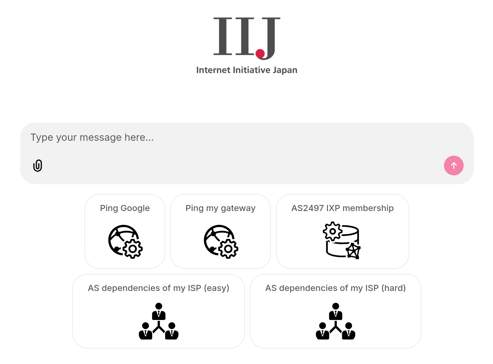

# Networking Agents Chatbot

An Ollama/LangGraph/Chainlit app showcasing networking-focused agents.

## Agents

Each agent uses a custom LangGraph implementation to support lightweight "thinking" models.

### data_retriever

A ReAct agent with two tools:

- `whois`: Queries bgp.tools for IP/ASN ownership info.
- `iypchat`: Natural language interface to the Internet Yellow Pages knowledge graph (powered by an LLM workflow).

**Features:**

- Dynamic context selection to explain Internet concepts:
  - Filtered explanations of Internet entities
  - Filtered knowledge graph schema
- Dynamic few-shot prompting using the CypherEval dataset

### network_operator

A ReAct agent with built-in networking tools:

- `ping`
- `traceroute`
- `get_routing_table`

### supervisor

A ReAct agent that delegates tasks to `data_retriever` and `network_operator`.

**Features:**

- Custom handoff messages between agents
- State injection to hide message history from other agents

## UI

**Features:**

- Streaming responses
- Chat memory
- Live execution tree integrated with LangGraph
- Agent state display alongside the conversation

**Demo:**

Coming soon!
